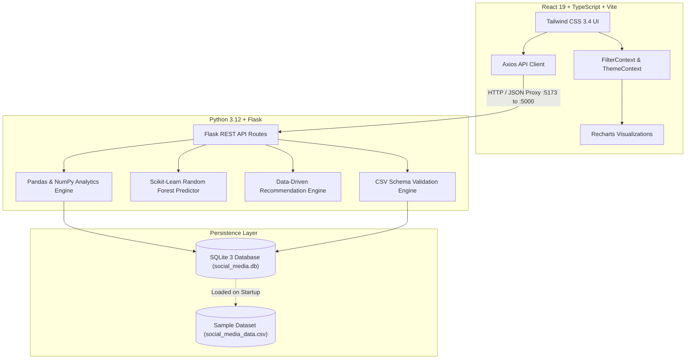

# 📊 Social Media Engagement Dashboard & AI Strategy Engine

[](https://python.org)
[](https://flask.palletsprojects.com/)
[](https://react.dev)
[](https://www.typescriptlang.org/)
[](https://vitejs.dev/)
[](https://tailwindcss.com/)
[](https://www.sqlite.org/)
[](https://scikit-learn.org/)

---

## 🌟 Project Overview

The **Social Media Engagement Dashboard** is a full-stack, enterprise-grade analytics application designed to track, benchmark, and optimize content across major social platforms (Instagram & YouTube). It transforms raw engagement numbers (likes, comments, shares, impressions, reach) into high-impact tactical decisions using statistical intelligence and machine learning.

Built as a production-ready portfolio project, it solves the challenge creators and brand managers face: moving from vanity metrics to actionable publishing strategies.

---

## 🎯 Problem Statement

Content creators, social media managers, and digital marketers post frequently without understanding the exact mathematical triggers behind their reach:
- What is the true engagement conversion rate when accounting for total impressions?
- Which specific day of the week and hour of the day yield peak engagement?
- Which formats (Reels, Shorts, Videos, Carousels, Static Posts) suffer from audience fatigue or low reach?
- How can creators simulate and forecast the engagement rate of a post before publishing?

This dashboard provides data-driven answers by calculating KPIs, analyzing temporal distributions, running ML regression simulations, and delivering dynamic strategic roadmaps.

---

## 🚀 Key Features

### 1. Executive Dashboard & KPI Metrics
- **6 Core Cards**: Total Posts, Total Likes, Total Comments, Total Shares, Total Impressions, and Average Engagement Rate.
- **Formula-Driven**: Calculates industry-standard engagement rate:
  $$\text{Engagement Rate} = \frac{\text{Likes} + \text{Comments} + \text{Shares}}{\text{Impressions}} \times 100$$
- **Interactive Metric Switcher**: Toggle time-series trends across any engagement dimension.

### 2. Engagement Analytics & Benchmarking
- **Temporal Progression**: Daily and weekly engagement curves with area gradients.
- **Platform Comparison**: Instagram vs. YouTube performance benchmarking.
- **Content Format Effectiveness**: Ranked comparisons between Reels, YouTube Shorts, Long-form Videos, Multi-image Posts, and Single Images.
- **Optimal 7×24 Posting Heatmap**: Visualizes engagement across all 168 hours of the week, highlighting golden posting windows and peak days.

### 3. Machine Learning Engagement Predictor
- Integrated **Scikit-Learn Random Forest Regressor** trained on dataset features (`platform`, `content_type`, `hour`, `day_of_week`, `caption_len`, `tag_count`).
- Interactive simulation interface to forecast engagement rates of draft posts before publishing.

### 4. Dynamic Content Strategy Recommendations
- **Zero hard-coded data**: All recommendations are derived mathematically from the active dataset.
- Highlights winning formats, format drag (underperforming content), recommended posting cadence, and top-converting hashtags.

### 5. Content Library & Post Explorer
- Searchable by caption keywords, post IDs, and `#hashtags`.
- Clickable column sorting by date, engagement rate, impressions, likes, comments, and shares.
- Modal inspector for deep post analysis and follower conversion ratios.

### 6. Dataset Ingestion & Validation
- Drag-and-drop CSV uploader with schema validation.
- Choice between **Replace Database** and **Append to Existing**.
- Real-time validation error reporting and immediate KPI recalculation.
- Sample dataset restore button and filtered CSV export.

### 7. Modern UI/UX
- Responsive design tailored for desktops, laptops, and mobile viewports.
- Light and Dark mode toggle with persistent local storage.
- Glassmorphic navigation bar, subtle animations, and skeleton loading states.

---

## 🛠️ Tech Stack & Architecture



---

## 📁 Project Structure

```
Social-Media-Engagement-Dashboard/
│
├── backend/
│   ├── app.py                      # Flask app entry point, CORS, and blueprint registration
│   ├── database.py                 # SQLite schema, queries, and data loaders
│   ├── models.py                   # Data models and CSV validation logic
│   ├── analytics.py                # Pandas/NumPy analytics and Scikit-learn ML model
│   ├── recommendations.py          # Data-driven strategy recommendation engine
│   ├── requirements.txt            # Python dependencies
│   ├── routes/
│   │   ├── __init__.py
│   │   ├── dashboard_routes.py     # GET /api/dashboard
│   │   ├── posts_routes.py         # GET /api/posts, GET /api/posts/<id>
│   │   ├── analytics_routes.py     # GET /api/analytics, /api/platforms, /api/content-types, etc.
│   │   ├── recommendations_routes.py # GET /api/recommendations
│   │   └── upload_routes.py        # POST /api/upload, POST /api/reset-data, GET /api/export
│   ├── data/
│   │   ├── generate_sample_data.py # Realistic data generator script
│   │   └── social_media_data.csv   # 250 realistic post records
│   ├── services/
│   │   ├── __init__.py
│   │   └── mock_external_api.py    # Adapters for Instagram Graph API & YouTube Data API v3
│   └── tests/
│       ├── __init__.py
│       └── test_backend.py         # 20 automated unit and integration tests
│
├── frontend/
│   ├── src/
│   │   ├── components/
│   │   │   ├── Layout.tsx          # Shell layout (Sidebar + Header + FilterBar)
│   │   │   ├── Sidebar.tsx         # Sidebar navigation with active badges
│   │   │   ├── Header.tsx          # Header with Dark/Light toggle, Export, Reset
│   │   │   ├── MetricCard.tsx      # KPI card with gradient accents
│   │   │   ├── FilterBar.tsx       # Platform, type, date range & engagement filters
│   │   │   └── Charts/
│   │   │       ├── TimeSeriesChart.tsx        # Multi-metric area chart
│   │   │       ├── PlatformComparisonChart.tsx# Instagram vs YouTube bar chart
│   │   │       ├── ContentTypeBarChart.tsx    # Format effectiveness bar chart
│   │   │       └── PostingTimeHeatmap.tsx     # 7x24 Day x Hour heatmap
│   │   ├── pages/
│   │   │   ├── DashboardPage.tsx   # Overview with 6 KPIs and quick insights
│   │   │   ├── AnalyticsPage.tsx   # Deep dive, heatmap, hashtags & ML predictor
│   │   │   ├── PostsPage.tsx       # Content library, sorting, search, pagination
│   │   │   ├── RecommendationsPage.tsx # Algorithmic strategy blueprint
│   │   │   └── UploadPage.tsx      # CSV upload, validation, and preview
│   │   ├── context/
│   │   │   ├── FilterContext.tsx   # Global filter state
│   │   │   └── ThemeContext.tsx    # Dark/Light mode provider
│   │   ├── services/
│   │   │   └── api.ts              # Typed Axios API client
│   │   ├── types/
│   │   │   └── index.ts            # TypeScript interfaces
│   │   ├── App.tsx                 # Root application component
│   │   ├── main.tsx                # React entry
│   │   └── index.css               # Tailwind CSS & custom scrollbar
│   ├── index.html
│   ├── package.json
│   ├── vite.config.ts              # Dev server with proxy to backend
│   └── tailwind.config.js          # Tailwind theme & dark mode config
│
├── README.md                       # Documentation
└── .gitignore                      # Git ignore rules
```

---

## 📊 Dataset Schema

The system uses a realistic CSV dataset containing 250 records spanning Instagram and YouTube.

| Field | Type | Description |
|---|---|---|
| `post_id` | String | Unique publication identifier (e.g. `IG_1004`, `YT_1001`) |
| `platform` | String | Publishing platform (`Instagram` or `YouTube`) |
| `post_date` | String | Date of publication in `YYYY-MM-DD` |
| `post_time` | String | Time of publication in `HH:MM` |
| `content_type` | String | Format (`Reels`, `Videos`, `Shorts`, `Posts`, `Images`) |
| `caption` | String | Publication caption and messaging text |
| `likes` | Integer | Total like reactions |
| `comments` | Integer | Total comments received |
| `shares` | Integer | Total times content was shared |
| `impressions` | Integer | Total views / feed displays |
| `reach` | Integer | Unique accounts reached |
| `followers` | Integer | Follower / Subscriber count at time of posting |
| `engagement_rate` | Float | Calculated as `(likes + comments + shares) / impressions * 100` |
| `hashtags` | String | Space-delimited hashtag string (e.g. `#techtrends #webdev`) |

---

## ⚡ Installation & Setup

### Prerequisites
- **Python**: 3.10+ (tested on Python 3.12)
- **Node.js**: 18+ (tested on Node.js v24 / npm 11)

### 1. Clone or Open Workspace
```bash
cd Social-Media-Engagement-Dashboard
```

### 2. Backend Setup
```bash
# Optional: create a virtual environment
python -m venv venv
# Windows:
venv\Scripts\activate
# macOS/Linux:
# source venv/bin/activate

# Install dependencies
pip install -r backend/requirements.txt

# Initialize database and load sample dataset
python backend/database.py
```

### 3. Frontend Setup
```bash
cd frontend
npm install
```

---

## 🏃 How to Run

### Start the Backend API (Terminal 1)
```bash
# In the root directory:
python backend/app.py
```
*API server will start on:* **`http://127.0.0.1:5000`**

### Start the Frontend Dashboard (Terminal 2)
```bash
# In the frontend directory:
cd frontend
npm run dev
```
*Vite web dashboard will start on:* **`http://localhost:5173`**

Open `http://localhost:5173` in your browser to view the interactive dashboard.

---

## 🧪 Running Automated Tests

Run the full backend unit test suite:
```bash
python -m unittest backend/tests/test_backend.py
```
All 20 test cases verify:
- Engagement rate formula precision
- CSV validation (valid data, missing columns, corrupt values)
- KPI summaries and time-series aggregations
- Platform and format comparisons
- 7×24 Best posting time heatmap matrix
- Recommendation engine outputs
- Scikit-learn ML predictor
- Flask API route endpoints

---

## 🌐 API Reference

| Endpoint | Method | Description | Parameters |
|---|---|---|---|
| `/` | `GET` | API root & discovery | None |
| `/api/health` | `GET` | Healthcheck & database status | None |
| `/api/dashboard` | `GET` | High-level KPIs, time-series snippet, breakdown | `platform`, `content_type`, `start_date`, `end_date`, `engagement_level` |
| `/api/posts` | `GET` | Paginated & sortable content library | `page`, `per_page`, `sort_by`, `sort_order`, `search`, filters |
| `/api/posts/<id>` | `GET` | Detail record for single post | `post_id` in path |
| `/api/analytics` | `GET` | Detailed time-series metrics | `granularity` (`daily`/`weekly`), filters |
| `/api/platforms` | `GET` | Instagram vs YouTube metrics | Filters |
| `/api/content-types` | `GET` | Content format effectiveness | Filters |
| `/api/best-posting-time` | `GET` | Day & hour distribution + 7×24 heatmap | Filters |
| `/api/hashtags` | `GET` | Ranked hashtag conversion stats | `platform` |
| `/api/predict` | `POST` | ML model simulation | `platform`, `content_type`, `hour`, `day_of_week`, `caption`, `hashtags` |
| `/api/upload` | `POST` | Ingest new CSV dataset | `file` (multipart), `mode` (`replace`/`append`) |
| `/api/reset-data` | `POST` | Restore 250 sample records | None |
| `/api/export` | `GET` | Export filtered dataset as CSV | Filters |

---

## 🔌 Future Enhancements
- **Live Social Media OAuth**: Connect directly to Instagram Graph API and YouTube Data API v3 using the pre-architected adapter (`backend/services/mock_external_api.py`).
- **NLP Sentiment Analysis**: Integrate VADER or HuggingFace transformers to evaluate comment sentiment and correlate with viral reach.
- **Automated Social Scheduling**: Webhook integration with Buffer or Meta Business Suite to schedule recommended slots directly from the dashboard.

---

## 👨‍💻 Author & Portfolio Note

Developed as a full-stack, data-driven software engineering portfolio project demonstrating:
- **Clean RESTful API Architecture** with Flask blueprints and modular service separation.
- **Data Engineering & Analytics** with Pandas vectorization, SQLite indexing, and statistical distribution modeling.
- **Applied Machine Learning** with Scikit-Learn pipelines and real-time inference.
- **Modern Responsive Frontend** using React 19, TypeScript, Vite, Tailwind CSS, and Recharts.
